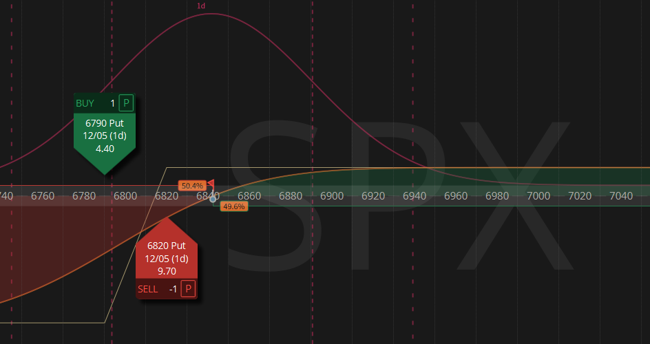

# VIX Gated 0 DTE SPX Bull Put Spreads - Presentation

A modern, interactive web-based presentation built for **OptionsUniversum**, showcasing a statistical arbitrage strategy in short-term volatility markets.



## 🚀 Overview

This project is a high-performance, visually engaging presentation site designed to explain the "VIX Gated 0 DTE SPX Bull Put Spread" strategy. It replaces traditional PowerPoint slides with a responsive, animated web experience.

**Key Features:**
*   **Interactive Slides:** Smooth scroll snapping and transition animations powered by `framer-motion`.
*   **Dynamic Visuals:** Custom-built charts, glassmorphism UI effects, and responsive layouts.
*   **Image Carousel:** Integrated `embla-carousel` for browsing strategy performance charts.
*   **Modern Tech Stack:** Built with React, Vite, and Tailwind CSS for optimal performance and developer experience.

## 🛠️ Tech Stack

*   **Framework:** [React](https://react.dev/) + [Vite](https://vitejs.dev/)
*   **Styling:** [Tailwind CSS](https://tailwindcss.com/) (v4)
*   **Animations:** [Framer Motion](https://www.framer.com/motion/)
*   **Icons:** [Lucide React](https://lucide.dev/)
*   **Carousel:** [Embla Carousel](https://www.embla-carousel.com/)
*   **Deployment:** GitHub Pages

## 📦 Getting Started

### Prerequisites
*   Node.js (v18 or higher)
*   npm

### Installation

1.  Clone the repository:
    ```bash
    git clone https://github.com/WonderAnaconda/optionsuniversum.git
    cd optionsuniversum/presentation-site
    ```

2.  Install dependencies:
    ```bash
    npm install
    ```

3.  Start the development server:
    ```bash
    npm run dev
    ```

4.  Open your browser at `http://localhost:5173/optionsuniversum/`

## 🚀 Deployment

This project is configured for automatic deployment to **GitHub Pages**.

To deploy a new version:

1.  **Commit your changes:**
    ```bash
    git add .
    git commit -m "Description of changes"
    git push origin main
    ```

2.  **Run the deploy script:**
    ```bash
    npm run deploy
    ```

This command builds the project (using `vite build`) and pushes the `dist` folder to the `gh-pages` branch.

## 📂 Project Structure

```
presentation-site/
├── public/             # Static assets (favicons, etc.)
├── src/
│   ├── assets/         # Images and diagrams
│   ├── App.jsx         # Main application component (Slides)
│   ├── index.css       # Global styles & Tailwind directives
│   └── main.jsx        # Entry point
├── package.json        # Dependencies and scripts
├── vite.config.js      # Vite configuration (base path set for GH Pages)
└── README.md           # Project documentation
```

## 🎨 Design System

The presentation uses a "Deep Space & Aurora" theme:
*   **Backgrounds:** Dark Zinc (`bg-zinc-950`) with subtle radial gradients (Indigo, Emerald, Blue, Violet, Amber, Rose).
*   **Glassmorphism:** `backdrop-blur-xl`, `bg-zinc-900/40`, and thin white borders for cards and panels.
*   **Typography:** `Inter` for UI text and `Roboto Mono` for data/technical details.

## 👥 Credits

*   **Presented for:** OptionsUniversum
*   **Topic:** VIX Gated 0 DTE SPX Bull Put Spreads
